<p align="center">
  
</p>

[](https://www.python.org/downloads/)
[](LICENSE)
[](https://github.com/mohossam01/plotsim/actions/workflows/ci.yml)
[](https://pypi.org/project/plotsim/)
[](https://mohossam01.github.io/plotsim/)

**Python library to generate synthetic multi-table relational datasets — star schema, correlated metrics, dbt-seed-ready CSV & Parquet. Config-driven, deterministic, no real data required**

```
pip install plotsim
```

plotsim generates multi-table relational datasets from a behavioral
description. You define metrics, segments, and how entities behave over
time — the engine produces a star schema where every value traces back to
one trajectory. **shape**: every entity follows a behavioral trajectory, and every metric across every table reads from the same trajectory position. When engagement rises, revenue follows. When it declines, churn fires.

## Quick start

```python
from plotsim import create, generate_tables

cfg = create(
    about="Subscription customers",
    unit="customer",
    window=("2024-01", "2024-12", "monthly"),
    metrics=[
        {"name": "engagement", "type": "score", "polarity": "positive"},
        {"name": "payments",   "type": "count", "polarity": "positive"},
    ],
    segments=[
        {"name": "active",   "count": 50, "archetype": "growth"},
        {"name": "inactive", "count": 30, "archetype": "decline"},
    ],
)
tables = generate_tables(cfg)
for name, df in tables.items():
    print(f"{name}: {len(df)} rows")
# dim_date: 12 rows
# dim_customer: 80 rows
# fct_customer: 960 rows
```

## Generate multi-table test data

<p align="center">
  
</p>

Top panel: one trajectory for one customer, 24 months. Bottom panel: four metrics on the same x-axis. Engagement and MRR rise with the trajectory; support tickets and churn risk fall as it rises. Every value reads from that one curve.

The same idea in tables — one company, twelve months, the same SaaS schema generated two ways:

**Random columns (Faker-style)** — every column is independent. The numbers don't agree.

| month   | engagement | mrr    | tickets | churn_risk |
| ------- | ---------: | -----: | ------: | ---------: |
| 2024-01 |      0.842 |  $483  |       7 |      0.611 |
| 2024-02 |      0.117 | $4,201 |       0 |      0.043 |
| 2024-03 |      0.674 | $1,089 |      11 |      0.892 |
| 2024-04 |      0.298 |  $112  |       2 |      0.355 |
| 2024-05 |      0.951 | $7,733 |       4 |      0.018 |
| 2024-06 |      0.024 |  $964  |       9 |      0.477 |
| 2024-07 |      0.560 | $2,154 |       1 |      0.802 |
| 2024-08 |      0.405 |  $328  |       6 |      0.220 |
| 2024-09 |      0.789 |  $617  |       0 |      0.998 |
| 2024-10 |      0.131 | $5,440 |       8 |      0.156 |
| 2024-11 |      0.847 |  $192  |       3 |      0.501 |
| 2024-12 |      0.334 | $3,876 |      12 |      0.063 |

Engagement at 0.95 with churn risk near zero, then 0.79 at the highest churn risk in the table. No story — only fields filled.

**plotsim (trajectory-correlated)** — `plotsim run saas`. Same `dim_company` row, twelve monthly rows from `fct_engagement`, `fct_revenue`, `fct_support_tickets`.

| month   | engagement | mrr    | tickets | churn_risk |
| ------- | ---------: | -----: | ------: | ---------: |
| 2024-01 |      0.587 | $1,191 |       0 |      0.261 |
| 2024-02 |      0.807 | $1,265 |       1 |      0.189 |
| 2024-03 |      1.000 | $3,532 |       2 |      0.129 |
| 2024-04 |      0.593 |  $818  |       0 |      0.171 |
| 2024-05 |      0.904 | $3,567 |       2 |      0.237 |
| 2024-06 |      0.956 | $4,264 |       1 |      0.257 |
| 2024-07 |      1.000 |  $302  |       2 |      0.000 |
| 2024-08 |      0.917 | $1,507 |       0 |      0.000 |
| 2024-09 |      1.000 |  $890  |       1 |      0.000 |
| 2024-10 |      0.783 |  $512  |       1 |      0.264 |
| 2024-11 |      0.956 |  $837  |       0 |      0.000 |
| 2024-12 |      0.827 |  $351  |       1 |      0.248 |

Engagement is climbing toward its plateau. MRR moves with it. Support tickets stay low. Churn risk stays near zero. All four columns read from the same underlying trajectory position — not from four independent random generators.

The contrast is the entire product.

## Star schema output

A `plotsim run` produces a complete star schema in the chosen output directory:

```text
output/
├── dim_date.csv                # complete date spine
├── dim_company.csv             # entity attributes (with SCD2 plan_tier)
├── dim_user.csv                # sub-entity attributes
├── dim_plan.csv                # reference lookup
├── fct_engagement.csv          # entity × period metrics
├── fct_revenue.csv             # entity × period metrics
├── fct_support_tickets.csv     # entity × period metrics
├── evt_login.csv               # proportional events
├── evt_churn.csv               # threshold-triggered events
├── config.yaml                 # frozen copy of the input config
└── validation_report.txt       # FK + PK + spine integrity checks
```

If a company's engagement trajectory declines, its login rows decrease in `evt_login.csv` and churn events appear in `evt_churn.csv` — both event tables read from the same trajectory the fact tables do.

Same config + same seed produces byte-identical output every time. CSV is the default; Parquet is one config flag away. See the [output guide](https://mohossam01.github.io/plotsim/user-guide/output-formats/) for format details and the manifest schema.


## Who is this for

**Educators and students** who need realistic datasets for SQL 
courses, data modeling workshops, analytics training, or portfolio 
projects — five domain templates ready to go, same seed produces 
the same data every time.

**Data engineers** who need test fixtures that behave like production 
data — with FK integrity, realistic distributions, and configurable 
corruption — without copying production or hand-rolling three-row 
CSVs.

**Data scientists** who need labeled training data with known ground 
truth — archetype labels, trajectory positions, and temporal holdout 
splits — to validate models before touching real data.

**Analytics engineers** who need a star schema to build dbt models, 
test transformations, or demonstrate a pipeline end-to-end without 
waiting for upstream data.

**BI and analytics teams** who need a populated star schema to 
build dashboards, test reports, or demo a new tool to stakeholders 
— dims, facts, events, and SCD versioning out of the box.

**Demo builders** who need a convincing dataset for a conference 
talk, a product walkthrough, or a proof of concept — correlated 
metrics that tell a realistic story, not random noise.


## How it works

```mermaid
flowchart LR
    A[YAML config<br/>or create&#40;&#41; builder]:::input --> B[Pydantic<br/>validation]:::stage
    B --> C[Trajectory<br/>engine]:::stage
    C --> D[Per-metric<br/>derivation]:::stage
    D --> E[Schema<br/>assembly]:::stage
    E --> F[CSV / Parquet<br/>+ manifest<br/>+ validation report]:::output

    classDef input fill:#eef2ff,stroke:#1f2a44,stroke-width:1px,color:#1f2a44
    classDef stage fill:#ffffff,stroke:#1f2a44,stroke-width:1px,color:#1f2a44
    classDef output fill:#e6f4f1,stroke:#1f2a44,stroke-width:1px,color:#1f2a44
```



Every entity in the dataset follows a **behavioral trajectory** — a 
curve shape like growth, decline, seasonal, or spike-then-crash. At 
each time period, the entity's position on that curve determines 
every metric value across every table. Revenue, engagement, churn 
risk, and support tickets all read from the same position, so they 
move together the way real business metrics do.

Metric relationships are enforced through a **Gaussian copula** — 
declare `engagement opposes churn_risk` and the engine delivers the 
configured correlation coefficient regardless of whether one metric 
is beta-distributed and the other is Poisson. Causal lags compose: 
if `A → B (lag 2) → C (lag 3)`, then C reflects A from 5 periods ago.

Output is **deterministic**. Every random draw flows through a single 
seeded `numpy.Generator`. Same config + same seed = byte-identical 
tables within the same Python and dependency versions. The manifest records 
every generation decision — archetype assignments, trajectory 
positions, correlation adjustments, quality injections — so any 
cell value can be traced back to its origin.

Config-time **validation** catches problems before generation starts: 
circular causal chains, non-positive-definite correlation matrices, 
broken foreign key references, duplicate metric names, and 
SQL-unsafe identifiers all surface as parse errors with fix 
suggestions.


See the [docs site](https://mohossam01.github.io/plotsim/) for the full pipeline.

## Docs

[mohossam01.github.io/plotsim](https://mohossam01.github.io/plotsim/) — quickstart, user guide, tutorials, API reference, cookbooks.

## Contributing

See [`CONTRIBUTING.md`](CONTRIBUTING.md) for dev setup, test commands, and how to add templates.

## License

Apache-2.0 — see [`LICENSE`](LICENSE) and [`NOTICE`](NOTICE).
